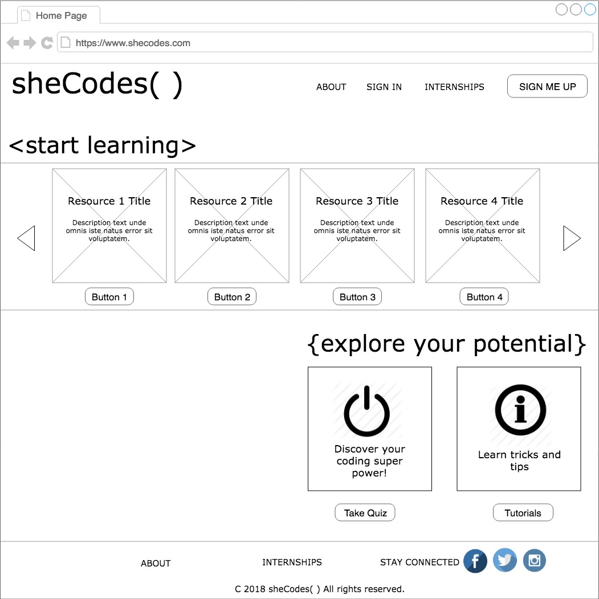
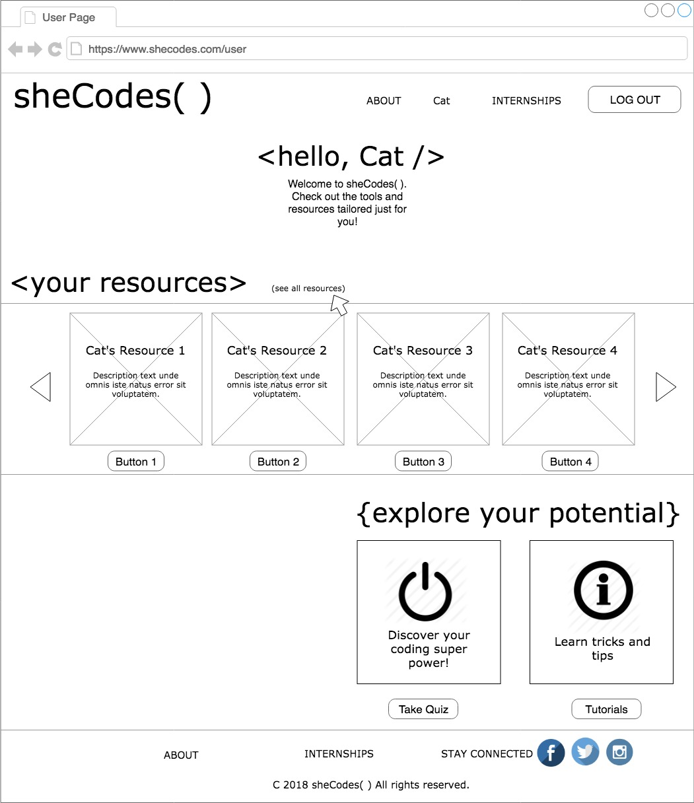

# Capstone Project Planning Phase I

### February 23, 2018

# Cat Janowitz

##  Description

# Name of Project: sheCodes( )

## Project's Purpose:

This app will serve as a resource for young women middle school-aged and up who are interested in learning about coding/tech. The home page will provide a tiled gallery of clickable online resources, some activities and a link to create a personal profile.  Collectively, the features of sheCodes( ) will help the user learn about coding via what's available in their area and online, which facet of coding/tech they are drawn to, and a way to create and track a profile that summarizes and personalizes their findings.

## sheCodes( ) MVP:
*	Provide a clickable gallery of all online resources for young women interested in tech
*	Allow user to submit a personal profile that includes basic info as well as a list of specific interests
*	After building a profile, and based on specific interests, user can access a tailored gallery of resources ( i.e., ‘my resources’ or ‘my dashboard’)
*	Allow user to take a quiz to find out what coding language best suits them (question-based or possibly image-based [more abstract])
*	Allow user to read a tutorial on how to build coding skills

## Tools, frameworks, libraries, APIs, modules and/or other resources used to create sheCodes( ):
####	React.js with at least the following libraries:
*	React-Redux
*	React-Bootstrap or Glamorous

####	Firebase to set up and host a custom database containing:
* collection of all resources, including keywords for creating tailored gallery for user

## Wishlist:
*	Add additional quizzes or tutorials (and if so, allow user to keep track of which quizzes and/or tutorials they’ve taken by displaying that data on their profile (stickers, number output, etc)
*	Use Firebase to create a profile for local sponsors and create a sponsors page for users to view
*	Create a forum where users and sponsors can see each other’s information and connect (this is not fully conceptualized yet)

## 'THINKING IN REACT' -guided Planning
### Step1: Mock ups

### Home Page Mock Up

### Sign Up Page Mock Up

### User Logged In Mock Up

### Quiz Mock Up

## Contact
thatcat13@gmail.com

Copyright (c) 2018 **Cat Janowitz**
